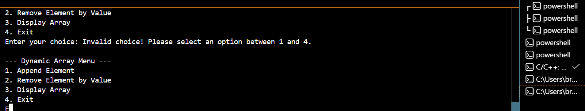

## Dynamic Array and LinkedList Build log
### Date: June 22 2026

### Duration: 2 Hours

### Goal: Implement DynamicArray append(T value) and insert(int index, T value) operations.
The primary goal of session 1 is to understand the DynamicArray and begin implementation of core operation append (T value) and remove (T value) according to the design proposal.

### Problem Encountered:
#### 1. Infinite loop
When I created a Menu consisting of 4 options that is to append, remove display or exit element- I tried adding multiple elements at once which lead me to infinite loop

### What I Tried: 
### What I Tried:
- Reviewed the menu loop and input handling logic.
- Added print statements to trace program execution.
- Tested the program with multiple consecutive insertions to reproduce the issue.
- Checked the loop termination condition and corrected the menu control flow.

### Outcome: 
Successfully implemented 
1. Constructor 
2. Destructor
3. resize()
4. append (T value)